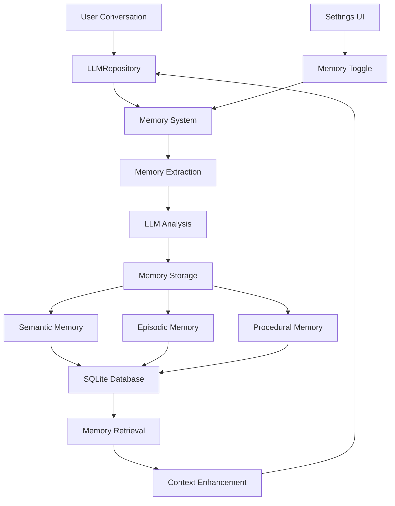
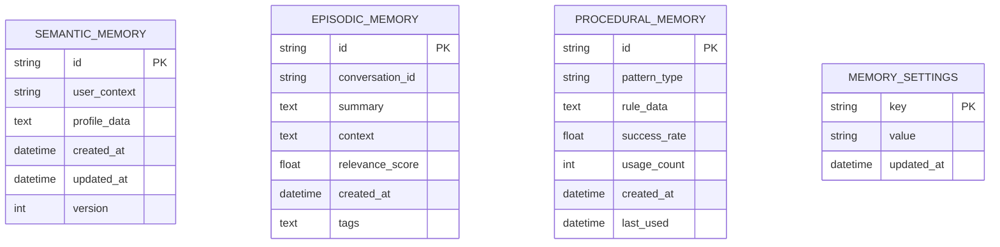
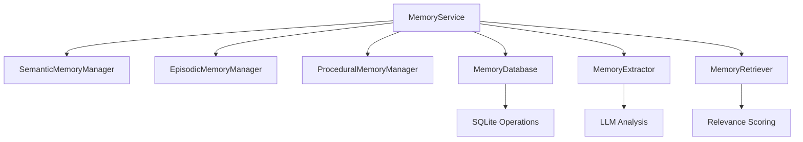
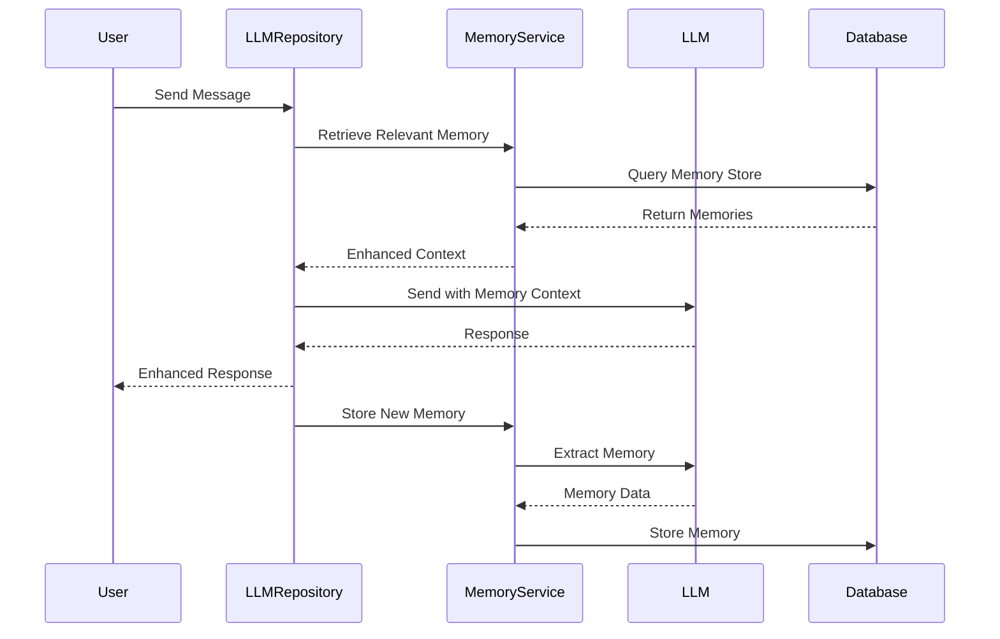

# Long-Term Memory Feature Architecture Plan

## Overview

This document outlines the implementation plan for adding a comprehensive long-term memory system to the LLM API Picker plugin, based on LangMem concepts. The system will implement three types of memory: Semantic, Episodic, and Procedural.

## Memory Types Implementation

### 1. Semantic Memory
- **Purpose**: Store facts, knowledge, and user preferences
- **Storage Pattern**: Profile-based (single document per user/context)
- **Examples**: User preferences, learned facts, knowledge triplets
- **Update Strategy**: Consolidate new information with existing profile

### 2. Episodic Memory  
- **Purpose**: Store past conversation experiences and summaries
- **Storage Pattern**: Collection-based (individual records per conversation)
- **Examples**: Conversation summaries, successful interaction patterns
- **Update Strategy**: Add new episodes, consolidate similar experiences

### 3. Procedural Memory
- **Purpose**: Store system behavior patterns and response styles
- **Storage Pattern**: Rule-based collections
- **Examples**: Preferred response styles, successful prompt patterns
- **Update Strategy**: Learn and refine behavioral rules over time

## System Architecture



## Database Schema Design



## Core Components

### 1. Memory Models

#### SemanticMemory
```dart
class SemanticMemory {
  String id;
  String userContext;
  Map<String, dynamic> profileData;
  DateTime createdAt;
  DateTime updatedAt;
  int version;
}
```

#### EpisodicMemory
```dart
class EpisodicMemory {
  String id;
  String conversationId;
  String summary;
  String context;
  double relevanceScore;
  DateTime createdAt;
  List<String> tags;
}
```

#### ProceduralMemory
```dart
class ProceduralMemory {
  String id;
  String patternType;
  Map<String, dynamic> ruleData;
  double successRate;
  int usageCount;
  DateTime createdAt;
  DateTime lastUsed;
}
```

### 2. MemoryService Architecture



### 3. Integration Points

#### LLMRepository Integration
- Memory context injection before LLM calls
- Memory extraction after successful interactions
- Automatic memory consolidation

#### Settings Integration
- Memory enable/disable toggle
- Memory management options
- Privacy controls

## Memory Processing Flow



## Implementation Strategy

### Phase 1: Foundation
1. Add SQLite dependency
2. Create memory models
3. Implement database schema
4. Create basic MemoryService

### Phase 2: Core Memory Types
1. Implement semantic memory
2. Implement episodic memory  
3. Implement procedural memory
4. Add memory extraction logic

### Phase 3: Integration
1. Integrate with LLMRepository
2. Add settings UI
3. Implement memory retrieval
4. Add context enhancement

### Phase 4: Advanced Features
1. Memory consolidation
2. Relevance scoring
3. Memory management utilities
4. Performance optimization

## Key Features

### Memory Extraction
- Automatic extraction from conversations
- LLM-powered analysis for memory creation
- Smart consolidation to avoid duplication

### Memory Retrieval
- Semantic similarity search
- Relevance scoring based on recency and frequency
- Context-aware memory selection

### Memory Management
- User-controlled enable/disable
- Memory cleanup and archiving
- Export/import capabilities
- Privacy controls

### Performance Considerations
- Efficient SQLite queries
- Memory caching for frequently accessed data
- Background processing for memory consolidation
- Configurable memory limits

## Privacy and Security
- Local storage only (no cloud sync)
- User control over memory retention
- Ability to clear specific memory types
- Transparent memory usage reporting

## Testing Strategy
- Unit tests for each memory type
- Integration tests with LLMRepository
- Performance tests with large memory stores
- User experience testing with memory features

This architecture provides a robust, scalable foundation for implementing comprehensive long-term memory in the LLM API Picker plugin, following LangMem best practices while maintaining user privacy and control.